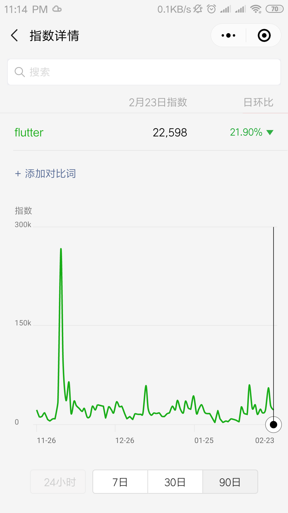
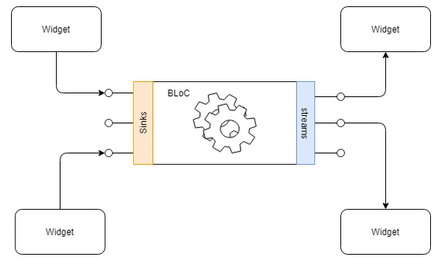

## 历史和其他跨平台方案对比图

> 据说 Flutter 最开始是 Google Chrome 浏览器小组成员进行的实验项目

Flutter 第一个版本代号叫 `Sky` 被运行在 Android 系统上，于 2015 年 Dart 开发者大会上亮相，非常有个性的是它以每秒120帧的速度来持续渲染呈现用户界面为目标。三年后（2018）第一个 beta 版本 在2月27日的世界移动大会上被公布，同年在上海举办的 Google 开发者大会上发布了第二个 beta 版本，依然是同年12月5日在 Flutter Live 上直接就官宣 1.0 releases 版本（最近发布了1.2版本），整个周期来看 Google 对 Flutter 投入了大量的资源在做这个事情。

第一次当我了解到 Flutter 时，最初的印象是惊奇于它既提供响应式视图又不需要 JavaScript 桥接器而且还是自己基于 Skia 绘制的UI（有一种还能这么玩的惊叹），当然它其他方面的特性也有足够的亮点，比如：

- 一切都是 Widget （就像你写 React 时一切都是 Component）
- 热重载（如果你开发过 Native 就能明白，有时候改动一个地方要重新编译，少的情况几十秒，多的时候几分钟都有）
- 响应式视图
- 布局其实和 CSS 很像
- Dart 编程语言

如果你要问我 Flutter 的优势，请看对比图：


某种程度上 Flutter 缺陷也比较明显，如：

- Dart 太小众 package 肯定没有 NPM 多
- 嵌入 platform View 成本很高
- 不管是 Weex 还是 React Native 对于具体平台的扩展，platform channel 大家都大同小异

如果你要问我 Flutter 怎么突然火了，那么我只能说 Flutter 的火爆有一种突然性，为此我专门去调研了微信，百度指数，看一看广大网友们的搜索数据：




通过指数我们可以看到最高线 12月5日 微信指数甚至有突破 300k 的趋势，正好这一天也是 Flutter Live 全球直播并发布1.0 releases版本的日子，在此之后指数就持续回落，整体趋势有些下降（个人猜测：*Flutter 估计在媒体上投放了一些宣传的广告*）。接着我通过不断的搜索在中文社区里也只找到闲鱼团队对它进行技术输出的痕迹，当然大厂带头，Flutter 部分满足了开发者的预期，各路吃瓜群众追随一波，存在感至少不会让人感觉落后，也许多数看热闹的人，心理活动就是如此吧。（个人猜测：*也许这也就是不知道为什么突然就火了，然后又突然归于平静原因。*）

国内程序员比较集中的社区关于 Flutter 的数据：


开发者头条：[https://toutiao.io/search?utf8=%E2%9C%93&q=flutter](https://toutiao.io/search?utf8=%E2%9C%93&q=flutter)

根据 Google I/O 公开数据的引用：

- Apple 和 Google 应用商店有超过1000个人基于Flutter的应用
- 阿里巴巴的闲鱼，腾讯的NOW，Google的Ads

对于 Flutter 的未来，我的判断如下：

- 官方根据 roadmap 持续开发
- 生态方面会有一定的补充
- 大厂应该会有限度的跟进，毕竟改造原有的基础设施也需要一段时间
- 中国大陆多数公司还是会持观望态度，或者有限跟进试验（考虑到中国大陆的多数基础设施，比如接微信SDK，leancloud SDK ，地图 SDK 都需要重写）

## 环境搭建和 Widget 基础

下载 [https://flutter.dev/docs/get-started/install/macos](https://flutter.dev/docs/get-started/install/macos) Flutter SDK 解压后将 flutter 添加到你的环境Path中。

```bash
export PATH="$HOME/flutter/bin:$PATH"
```

运行 `flutter doctor` 命令查看一下依赖环境：

```
Doctor summary (to see all details, run flutter doctor -v):
[✓] Flutter (Channel stable, v1.2.1, on Mac OS X 10.14.3 18D109, locale
    zh-Hans-CN)
[✓] Android toolchain - develop for Android devices (Android SDK version 28.0.3)
[✓] iOS toolchain - develop for iOS devices (Xcode 10.1)
[✓] Android Studio (version 3.2)
[✓] VS Code (version 1.31.1)
[!] Connected device
    ! No devices available
! Doctor found issues in 1 category.
```

> 我的建议是先安装 Xcode 在 iOS 上进行开发，因为 Android SDK Android Studio 要翻墙，等最终要发布时再安装 Android 的环境。

运行 `flutter create my_flutter_app` 创建一个 Flutter 工程

> 在运行 Flutter 工程之前，需要先把 iOS Simulator 启动起来。

最后运行 `flutter run` 将工程运行到 iOS Simulator：


如果你实在不是很清楚这些命令行有什么用，这时还可以输入如下命令来查看：

```bash
$ flutter run -h
```

如果有一天 Flutter 升级了版本，你可以通过如下命令进行升级并查看依赖环境：

```bash
$ flutter upgrade
$ flutter doctor  
```

在 Flutter 的世界里一切都是 `Widget` 并且提供了两个非常基础有用的 Widget（StatelessWidget 和 StatefulWidget），对于 StatelessWidget 来说我们只需要重载 build 方法即可，而 StatefulWidget 则需要和 State 配合着使用，它的设计原则非常有趣，对于 React 开发者来说几乎可以无缝切换，先让我们来从头实现一个 StatelessWidget 来一窥其内部的工作情况：

```dart
import 'package:flutter/material.dart';

void main() => runApp(MyApp());

class FlutterBookElement extends ComponentElement {
  FlutterBookElement(FlutterBooklessWidget widget): super(widget);

  @override
  FlutterBooklessWidget get widget => super.widget;

  @override
  Widget build() => widget.build(this);

  @override
  void update(FlutterBooklessWidget newWidget){
    super.update(newWidget);
    rebuild();
  }
}

abstract class FlutterBooklessWidget extends Widget {
  const FlutterBooklessWidget({Key key}):super(key: key);

  @override
  FlutterBookElement createElement() => new FlutterBookElement(this);

  @protected
  Widget build(BuildContext context);
}

class MyApp extends FlutterBooklessWidget {
  // This widget is the root of your application.
  @override
  Widget build(BuildContext context) {
    return MaterialApp(
      title: 'Flutter Demo',
      theme: ThemeData(
        primarySwatch: Colors.blue,
      ),
      home: new Text('Flutter Demo Home Page')
    );
  }
}
```

不管是 StatelessWidget 还是 StatefulWidget 都继承于 Widget 这个类，当我们一直往前追寻时都能发现这些定义都是抽象类，这也意味着它们都需要被继承之后才能实现（约定的一些属性或方法），最后我们看一看 runApp 做了什么事情？

```dart
void runApp(Widget app) {
  WidgetsFlutterBinding.ensureInitialized()
    ..attachRootWidget(app)
    ..scheduleWarmUpFrame();
}
```

通过这个方法传入MyApp对象 ，由此接管，我们想象一下这样的设计，是不是和 react react-dom 非常像？在 UI 的哲学世界里对于结构，样式，行为，都可以用 Widget 来描述，引擎通过这些描述来完成 UI 的绘制和行为交互，这也是为什么 Flutter 始终给自己的定位是 UI 框架。

## 生命周期详解和平台特性

关于生命周期，如果你写过 iOS 的 ViewController 其实能够明白在 UI 绘制的路径中这是多么的有用，Flutter 将生命周期分为了两个部分，一个部分是 Widget 的生命周期，一个部分是关于平台的生命周期，不过 Widget 的生命周期会被体现在 State 中，源码可参考：[https://github.com/flutter/flutter/blob/master/packages/flutter/lib/src/widgets/framework.dart#L930](https://github.com/flutter/flutter/blob/master/packages/flutter/lib/src/widgets/framework.dart#L930) ，生命周期这一部分的理解对于写出一个合理的 Widget 至关重要。


从上图中我们可以了解到 Widget 生命周期大体分为三类：

- 初始化
- 状态改变
- 销毁

### initState

当插入渲染树的时候被调用，这个函数在整个 Widget 的生命周期内只会被调用一次，因此在这里可以做一些初始化的事情。

### didChangeDependencies

这个函数会在 initState 之后被调用，在这个函数中你可以跨 Widget 拿到数据。

### didUpdateWidget

当你调用了 setState 将 Widget 的状态被改变时 didUpdateWidget 会被调用，Flutter 会创建一个新的 Widget 来绑定这个 State，并在这个方法中传递旧的 Widget ，因此如果你想比对新旧 Widget 并且对 State 做一些调整，你可以用它，另外如果你的某些 Widget 上涉及到 controller 的变更，要么一定要在这个回调方法中移除旧的 controller 并创建新的 controller 监听。

```dart
@override
void didUpdateWidget(AVCycleLess oldWidget){
  super.didUpdateWidget(oldWidget);
}
```

### deactivate

在 dispose 之前被调用。

### dispose

某些情况下你的 Widget 被释放了，一个很经典的例子是 Navigator.pop 被调用，如果被释放的 Widget 中有一些监听或持久化的变量，你需要在 dispose 中进行释放，在我们学习 Bloc 或 Stream 时应该能了解 dispose ，在这个回调方法中去关闭 Stream。

```dart
void dispose(){
  _countController.close();
  _actionController.close();
}
```

我们知道在 App 中会有比如从前台切入到后台再从后台切入到前台的场景，在 iOS 中这些生命周期都可以在 AppDelegate 中被体现，那么 Flutter 中我们该如何处理这些场景？对于 App 级别的生命周期与上述 Widget 生命周期相比，稍有不同。

源代码可参考：[https://github.com/flutter/flutter/blob/master/packages/flutter/lib/src/widgets/binding.dart](https://github.com/flutter/flutter/blob/master/packages/flutter/lib/src/widgets/binding.dart)

```dart
flutter: AppLifecycleState.inactive
flutter: AppLifecycleState.paused
flutter: AppLifecycleState.inactive
flutter: AppLifecycleState.resumed
```

上述是 App 级别生命周期的执行顺序。

先让我们来改造一下 AVCycleLess 这个 StatefulWidget，如果我们想监听 App 级别的生命周期需要使用 WidgetsBinding 来监听 WidgetsBindingObserver，因此我们需要把 State 稍微改变一下，并且我们也需要在 dispose 回调方法中移除这个监听。

```dart
class AVCycleLessState extends State<AVCycleLess> with WidgetsBindingObserver {}
```

重载 didChangeAppLifecycleState ，Flutter 封装了一个枚举 AppLifecycleState 来描述这个生命周期，完整代码如下：

```dart
class AVCycleLess extends StatefulWidget {

  AVCycleLess({Key key}): super(key: key);

  AVCycleLessState createState() =>  new AVCycleLessState();
}

class AVCycleLessState extends State<AVCycleLess> with WidgetsBindingObserver {


  @override
  void initState(){
    super.initState();
    WidgetsBinding.instance.addObserver(this);
  }

  @override
  Widget build(BuildContext context){
    return new MaterialApp(
      home: new Scaffold(
        appBar: new AppBar(
          title: new Text('AVCycleLess'),
        ),
        body: new Center(
          child: new Text('AVCycleLess---'),
        ),
      ),
    );
  }

  @override
  void didChangeAppLifecycleState(AppLifecycleState state) {
    debugPrint('$state');
  }

  @override
  void dispose(){
    WidgetsBinding.instance.removeObserver(this);
    super.dispose();
  }
}
```

## 处理异步的几种方式

由于 Dart 和 JavaScript 非常类似，也属于一种单线程模型的编程语言，因此我们不得不要关注到异步处理的情况，这一小节将着重描述关于 Dart 世界中异步处理的几种方式，先让我们来看一看 Future：

> 异步处理的方法都在 dart:async 中，必须要导入。

### Future

Future 可以允许我们注册回调函数来处理计算返回值或者异常，基本上可以说这是 Dart 关于异步处理的基础。

创建一个简单的 Future：

```dart
new Future((){
  return 'icepy';
}).then((data) {
  print(data);
});
```

创建一个理解返回的 Future：

```dart
Future.value('123').then((data){
  print(data);
});
```

如何在 Future 中处理异常：

```dart
new Future((){
  throw Exception('第一个异常');
}).then((data){
  return 12;
}, onError: (e){
  print('第一个onError e=$e');
}).then((s){
  throw Exception("第二个异常:$s");
}).catchError((e) {
  print("catch ${e}");
});
```

如何将多个异步函数的返回汇总：

```dart
Future<int> a() async{
  return 1;
}

Future<int> b() async{
  return 2;
}

Future<int> c() async{
  return 3;
}

Future.wait([a(),b(),c()]).then((data) {
  print(data);
}).catchError((error){
  print(error);
});
```

`wait` 函数可以等待多个异步函数执行之后将数据汇总抛给 then ，但如果其中有一个函数抛错，那么将立即进入 catchError 流程。Future API 提供了非常丰富的构造函数，大家可以着重学习一下。

### async/await

Future 非常适合处理单次的异步任务，当任务次数多起来之后，明显对于程序来说会有一些阅读障碍，因此我们需要使用 async/await 来处理这个问题。

> async 函数可以随处调用，它将返回一个 Future,await 只能在 async 函数中使用。

```dart
Future<int> a() async{
  return 1
}

a().then((data){
  // data = 1
});
```

至于 await 的使用，只要在 async 函数中即可：

```dart
Future<int> d() async{
  final n = await Future.value(123).then((data){
    return data;
  });
  return n;
}

void main(){
  d().then((data){
    print(data);
  });
}
```

### Stream

关于 Stream 你可以理解为利用 `事件` 的方式来驱动异步流程的处理，如果你有兴趣的话可以认真阅读：[https://github.com/icepy/flutter-book/blob/master/doc/upday/stream.md](https://github.com/icepy/flutter-book/blob/master/doc/upday/stream.md)，这里不再复述。

### Generator

关于 Generator 我们可以将其理解为一系列等待执行的序列，在 Dart 中，我们可以使用 `sync*` 和 `async*` 来实现自己的 Generator。

同步 Generator 函数返回的是 Iterable：

```dart
Iterable<int> naturalsTo(int n) sync* {
  int k = 0;
  while (k < n) yield k++;
}
```

异步 Generator 函数返回的是 Stream：

```dart
Stream<int> asynchronousNaturalsTo(int n) async* {
  int k = 0;
  while (k < n) yield k++;
}
```

由于 Stream 在另外一篇文章中有详解，因此关于 Iterable 补充一下，迭代器可以按顺序访问的方式来获取其中的值，我们可以通过`moveNext` 来完成，如果调用返回的是 true 则说明迭代器已经移动到了一下个元素，你可以使用 current 属性来获取。如果你的 Generator 是用于递归的，那么可以使用 yield* 来提高性能。

## 如何开发与发布一个 Package

以 [DayDart](https://github.com/icepy/flutter_daydart) 为例子讲解一下如何开发和发布一个 Package，首先我们需要利用 flutter 命令行工具创建一个 Package：

```bash
$ flutter create --template=package flutter_daydart
```

在实现的过程中我定义了一个 `library daydart` export 出了具体实现的文件 DayDart.dart，当你开发完成这些工作时，最后的环节是修改 `pubspec.yaml` 文件，如：

```yaml
name: flutter_daydart
description: 具备 Moment.js 一样 API 的时间处理库.
version: 0.0.3
author: icepy<xiangwenwe@gmail.com>
homepage: https://github.com/icepy/flutter_daydart
repository: https://github.com/icepy/flutter_daydart
environment:
  sdk: ">=2.0.0-dev.68.0 <3.0.0"

dependencies:
  flutter:
    sdk: flutter

dev_dependencies:
  flutter_test:
    sdk: flutter

# For information on the generic Dart part of this file, see the
# following page: https://www.dartlang.org/tools/pub/pubspec

# The following section is specific to Flutter.
flutter:

  # To add assets to your package, add an assets section, like this:
  # assets:
  #  - images/a_dot_burr.jpeg
  #  - images/a_dot_ham.jpeg
  #
  # For details regarding assets in packages, see
  # https://flutter.io/assets-and-images/#from-packages
  #
  # An image asset can refer to one or more resolution-specific "variants", see
  # https://flutter.io/assets-and-images/#resolution-aware.

  # To add custom fonts to your package, add a fonts section here,
  # in this "flutter" section. Each entry in this list should have a
  # "family" key with the font family name, and a "fonts" key with a
  # list giving the asset and other descriptors for the font. For
  # example:
  # fonts:
  #   - family: Schyler
  #     fonts:
  #       - asset: fonts/Schyler-Regular.ttf
  #       - asset: fonts/Schyler-Italic.ttf
  #         style: italic
  #   - family: Trajan Pro
  #     fonts:
  #       - asset: fonts/TrajanPro.ttf
  #       - asset: fonts/TrajanPro_Bold.ttf
  #         weight: 700
  #
  # For details regarding fonts in packages, see
  # https://flutter.io/custom-fonts/#from-packages
```

提交：

```bash
$ sudo flutter packages pub publish
```

如果你是第一次发布，在终端上会给你一个 URL 地址，复制这个地址在浏览器中打开，（这几步包括上传都需要翻墙）会跳转到 Google OAuth2 登录授权的流程，授权成功之后，终端上就可以继续上传了。

> 建议：在开发的过程中，可以利用 flutter test 命令来进行测试

## 何谓 Bloc 又如何设计好 Bloc

这是一种设计模式，由 paolo soares 和 cong hui 在2018年Google dartconf上提出，具体可参看 [https://www.youtube.com/watch?v=PLHln7wHgPE](https://www.youtube.com/watch?v=PLHln7wHgPE)，Bloc 是英文 Business Logic Component 的缩写，基本从字面的意思上来看，它是一种面向组件和业务逻辑的分离的优雅策略，通常我习惯性的将设计模式称之为一种策略。它利用了 Stream 的特性，为大量业务逻辑的分离提供了优雅的策略。



> 建议大家先行阅读 [https://github.com/icepy/flutter-book/blob/master/doc/upday/bloc.md](https://github.com/icepy/flutter-book/blob/master/doc/upday/bloc.md)

既然它的目标是分离业务逻辑，一般情况下我们会把逻辑都移动到 Bloc 侧，但有时候会同一个 outInput 会有多个输出源去执行不同的逻辑，我们可以在数据结构上去做一些改动，比如：

```dart
class BlocData<T> {
  final T data;
  final String action;
  final dynamic params;

  BlocData(this.action, {
    this.params,
    this.data
  });
}
```

对于 Bloc 侧定义一些不同执行的方法包装起来，比如：

```dart
void toggleIndexCollections(int index){
  _inputPhotoDirs.add(new BlocData(
    ActionToggle,
    params: index
  ));
}
```

最后在 Widget 中调用：

```dart
bloc.toggleIndexCollections(index);
```

源码例子参考：[https://github.com/icepy/flutter-dress/blob/dev/lib/bloc/DressPhotoDirsBlocData.dart](https://github.com/icepy/flutter-dress/blob/dev/lib/bloc/DressPhotoDirsBlocData.dart) 和 [https://github.com/icepy/flutter-dress/blob/dev/lib/pages/dress_photos_page.dart](https://github.com/icepy/flutter-dress/blob/dev/lib/pages/dress_photos_page.dart)

这种方式其实和 redux 的设计有一些像，当你的 Action 特别多的时候，就会感觉到很啰嗦。

在业务层面，我们应该遵循的设计大家可以借鉴参考一下：

- 在 App 的顶层通过 `ApplicationBloc` 来管理整个 App 的状态
- 每一个业务页面都应该有它自己的 `Bloc`
- 当一个 Widget 封装的足够复杂时，它也应该有自己的 `Bloc`
- 对于 stream 的运用可以多遵循其本身方法，比如 map where 等


```dart
FavoriteMovieBloc(MovieCard movieCard){
  _favoritesController.stream
                      .map((list) => list.any((MovieCard item) => item.id == movieCard.id))
                      .listen((isFavorite) => _isFavoriteController.add(isFavorite));
}
```