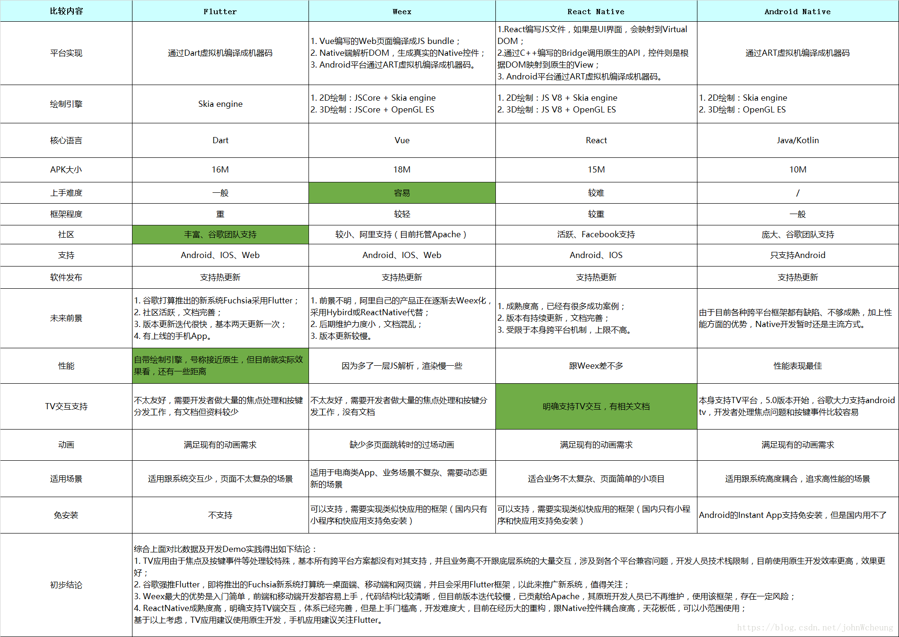
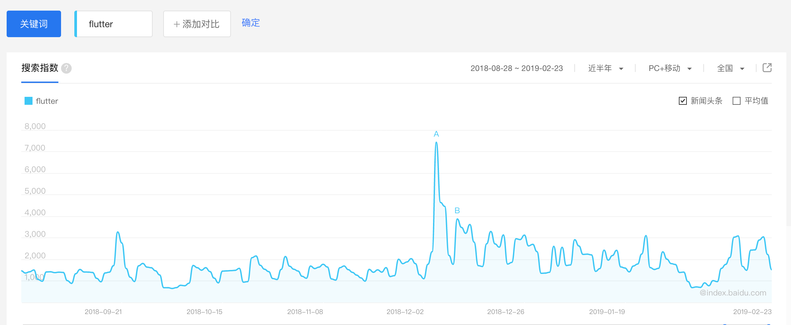

## 历史和其他跨平台方案对比图

> 据说 Flutter 最开始是 Google Chrome 浏览器小组成员进行的实验项目

Flutter 第一个版本代号叫“Sky” 被运行在 Android 系统上，于 2015 年 Dart 开发者大会上亮相，非常有个性的是它的目标是以每秒120帧的速度来持续渲染呈现用户界面。三年后（2018）第一个 beta 版本 在2月27日的世界移动大会上被公布，同年在上海举办的 Google 开发者大会上发布了第二个 beta 版本。依然是同年12月5日在 Flutter Live 上直接就官宣了 1.0 releases 版本。

第一次当我了解到 Flutter 时，最初的印象是惊奇于既提供响应式视图又不需要 JavaScript 桥接器而且还是自己基于 Skia 绘制的UI（有一种还能这么玩的惊叹），当然它其他方面的特性也有足够的亮点，比如：

- 一切都是 Widget （就像你写 React 时一切都是 Component）
- 热重载（如果你开发过 Native 就能明白，有时候改动一个地方要重新编译，少的情况几十秒，多的时候几分钟都有）
- 响应式视图
- 布局其实和 CSS 很像
- Dart 编程语言

如果你要问我 Flutter 的优势，请看对比图：

某种程度上 Flutter 缺陷也比较明显，如：

- Dart 太小众 package 肯定没有 NPM 多
- 嵌入 platform View 成本很高
- 不管是 Weex 还是 React Native 对于具体平台的扩展，platform channel 大家都大同小异

如果你要问我 Flutter 怎么突然火了，那么我只能说 Flutter 的火爆有一种突然性，为此我专门去调研了微信，百度指数，看一看广大网友们的搜索数据：

通过指数我们可以看到最高线 12月5日 微信指数甚至有突破 300k 的趋势，正好这一天也是 Flutter Live 全球直播并发布1.0 releases版本的日子，在此之后指数就持续回落，整体趋势有些下降（个人猜测：Flutter 估计在媒体上投放了一些宣传的广告）。接着我通过不断的搜索在中文社区里也只找到闲鱼团队对它进行技术输出的痕迹，当然大厂带头，Flutter 部分满足了开发者的预期，各路吃瓜群众追随一波，存在感至少不会让人感觉落后，也许多数看热闹的人，心理活动就是如此吧。（个人猜测：也许这也就是不知道为什么突然就火了，然后又突然归于平静原因）

根据 Google I/O 公开数据的引用：

- Apple 和 Google 应用商店有超过1000个人基于Flutter的应用
- 阿里巴巴的闲鱼，腾讯的NOW，Google的Ads

对于 Flutter 的未来，我的判断如下：

- 官方根据 roadmap 持续开发
- 生态方面会有一定的补充
- 大厂应该会有限度的跟进，毕竟改造原有的基础设施也需要一段时间
- 中国大陆多数公司还是会持观望态度，或者有限跟进试验（考虑到中国大陆的多数基础设施，比如接微信SDK，leancloud SDK 等等）
