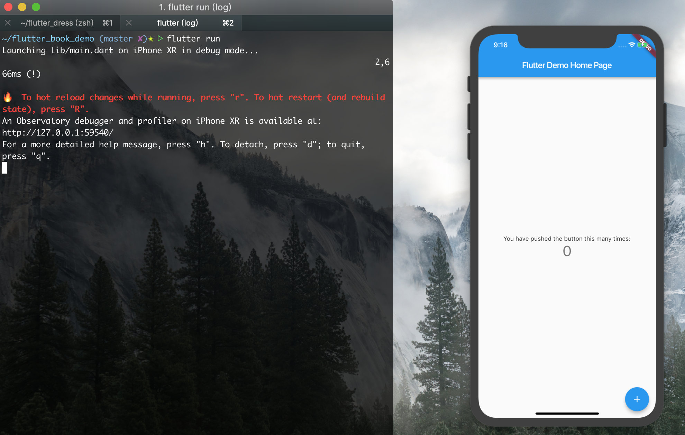

## 历史和其他跨平台方案对比图

> 据说 Flutter 最开始是 Google Chrome 浏览器小组成员进行的实验项目

Flutter 第一个版本代号叫“Sky” 被运行在 Android 系统上，于 2015 年 Dart 开发者大会上亮相，非常有个性的是它的目标是以每秒120帧的速度来持续渲染呈现用户界面。三年后（2018）第一个 beta 版本 在2月27日的世界移动大会上被公布，同年在上海举办的 Google 开发者大会上发布了第二个 beta 版本。依然是同年12月5日在 Flutter Live 上直接就官宣了 1.0 releases 版本。

第一次当我了解到 Flutter 时，最初的印象是惊奇于既提供响应式视图又不需要 JavaScript 桥接器而且还是自己基于 Skia 绘制的UI（有一种还能这么玩的惊叹），当然它其他方面的特性也有足够的亮点，比如：

- 一切都是 Widget （就像你写 React 时一切都是 Component）
- 热重载（如果你开发过 Native 就能明白，有时候改动一个地方要重新编译，少的情况几十秒，多的时候几分钟都有）
- 响应式视图
- 布局其实和 CSS 很像
- Dart 编程语言

如果你要问我 Flutter 的优势，请看对比图：


某种程度上 Flutter 缺陷也比较明显，如：

- Dart 太小众 package 肯定没有 NPM 多
- 嵌入 platform View 成本很高
- 不管是 Weex 还是 React Native 对于具体平台的扩展，platform channel 大家都大同小异

如果你要问我 Flutter 怎么突然火了，那么我只能说 Flutter 的火爆有一种突然性，为此我专门去调研了微信，百度指数，看一看广大网友们的搜索数据：


通过指数我们可以看到最高线 12月5日 微信指数甚至有突破 300k 的趋势，正好这一天也是 Flutter Live 全球直播并发布1.0 releases版本的日子，在此之后指数就持续回落，整体趋势有些下降（个人猜测：Flutter 估计在媒体上投放了一些宣传的广告）。接着我通过不断的搜索在中文社区里也只找到闲鱼团队对它进行技术输出的痕迹，当然大厂带头，Flutter 部分满足了开发者的预期，各路吃瓜群众追随一波，存在感至少不会让人感觉落后，也许多数看热闹的人，心理活动就是如此吧。（个人猜测：也许这也就是不知道为什么突然就火了，然后又突然归于平静原因）

根据 Google I/O 公开数据的引用：

- Apple 和 Google 应用商店有超过1000个人基于Flutter的应用
- 阿里巴巴的闲鱼，腾讯的NOW，Google的Ads

对于 Flutter 的未来，我的判断如下：

- 官方根据 roadmap 持续开发
- 生态方面会有一定的补充
- 大厂应该会有限度的跟进，毕竟改造原有的基础设施也需要一段时间
- 中国大陆多数公司还是会持观望态度，或者有限跟进试验（考虑到中国大陆的多数基础设施，比如接微信SDK，leancloud SDK 等等）

## 环境搭建和 Widget 基础

下载 [https://flutter.dev/docs/get-started/install/macos](https://flutter.dev/docs/get-started/install/macos) Flutter SDK 解压后将 flutter 添加到你的环境Path中。

```bash
export PATH="$HOME/flutter/bin:$PATH"
```

运行 `flutter doctor` 命令查看一下依赖环境：

```
Doctor summary (to see all details, run flutter doctor -v):
[✓] Flutter (Channel stable, v1.2.1, on Mac OS X 10.14.3 18D109, locale
    zh-Hans-CN)
[✓] Android toolchain - develop for Android devices (Android SDK version 28.0.3)
[✓] iOS toolchain - develop for iOS devices (Xcode 10.1)
[✓] Android Studio (version 3.2)
[✓] VS Code (version 1.31.1)
[!] Connected device
    ! No devices available
! Doctor found issues in 1 category.
```

> 我的建议是先安装 Xcode 在 iOS 上进行开发，因为 Android SDK Android Studio 要翻墙，等最终要发布时再安装 Android 的环境。

运行 `flutter create my_flutter_app` 创建一个 Flutter 工程

> 在运行 Flutter 工程之前，需要先把 iOS Simulator 启动起来。

最后运行 `flutter run` 将工程运行到 iOS Simulator：



如果你实在不是很清楚这些命令行有什么用，这时还可以输入如下命令来查看：

```bash
$ flutter run -h
```

如果有一天 Flutter 升级了版本，你可以通过如下命令进行升级并查看依赖环境：

```bash
$ flutter upgrade
$ flutter doctor  
```

在 Flutter 的世界里一切都是 `Widget` 并且提供了两个非常基础有用的 Widget（StatelessWidget 和 StatefulWidget），对于 StatelessWidget 来说我们只需要重载 build 方法即可，而 StatefulWidget 则需要和 State 配合着使用，它的设计原则非常有趣，对于 React 开发者来说几乎可以无缝切换，先让我们来从头实现一个 StatelessWidget 来一窥其内部的工作情况：

```dart
import 'package:flutter/material.dart';

void main() => runApp(MyApp());

class FlutterBookElement extends ComponentElement {
  FlutterBookElement(FlutterBooklessWidget widget): super(widget);

  @override
  FlutterBooklessWidget get widget => super.widget;

  @override
  Widget build() => widget.build(this);

  @override
  void update(FlutterBooklessWidget newWidget){
    super.update(newWidget);
    rebuild();
  }
}

abstract class FlutterBooklessWidget extends Widget {
  const FlutterBooklessWidget({Key key}):super(key: key);

  @override
  FlutterBookElement createElement() => new FlutterBookElement(this);

  @protected
  Widget build(BuildContext context);
}

class MyApp extends FlutterBooklessWidget {
  // This widget is the root of your application.
  @override
  Widget build(BuildContext context) {
    return MaterialApp(
      title: 'Flutter Demo',
      theme: ThemeData(
        primarySwatch: Colors.blue,
      ),
      home: new Text('Flutter Demo Home Page')
    );
  }
}
```

不管是 StatelessWidget 还是 StatefulWidget 都继承于 Widget 这个类，当我们一直往前追寻时都能发现这些定义都是抽象类，这也意味着它们都需要被继承之后才能实现（约定的一些属性或方法），最后我们看一看 runApp 做了什么事情？

```dart
void runApp(Widget app) {
  WidgetsFlutterBinding.ensureInitialized()
    ..attachRootWidget(app)
    ..scheduleWarmUpFrame();
}
```

通过这个方法传入MyApp对象 ，由此接管，我们想象一下这样的设计，是不是和 react react-dom 非常像？

## 生命周期详解和平台特性

